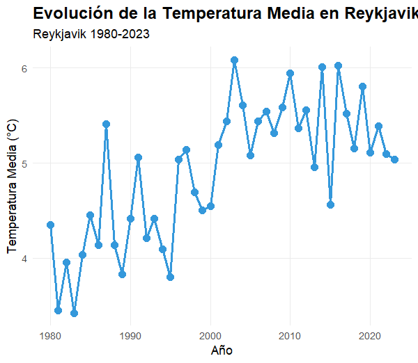
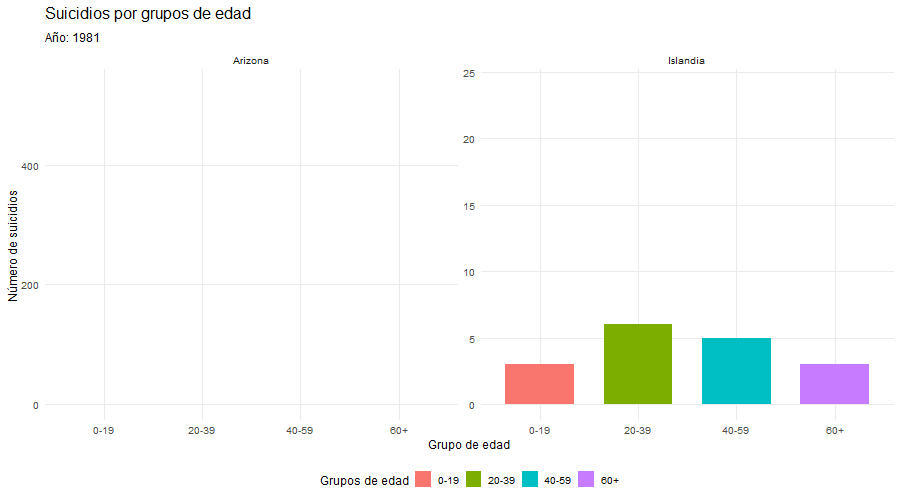

# Proyecto: Bajo el Sol y el Frío Extremo — Analizando la Influencia Climática Extrema en la Tasa de Suicidio.
## Introducción:

Las condiciones climáticas extremas se han convertido en un factor cada vez más relevante para comprender su impacto en la salud humana. En particular, la relación entre las variaciones térmicas y la salud mental ha captado la atención de la comunidad científica en los últimos años. Diversos estudios sugieren que tanto el calor extremo como el frío intenso pueden influir en el bienestar psicológico y, en casos extremos, contribuir a un aumento en las tasas de suicidio.
Este proyecto analiza esta posible asociación comparando dos regiones con climas marcadamente opuestos: Arizona, caracterizada por temperaturas extremadamente altas, e Islandia, conocida por su clima frío y variable. A través de la integración de datos climáticos y estadísticas oficiales de suicidio, se busca evaluar si las anomalías térmicas presentan una correlación significativa con los cambios en la conducta suicida a lo largo del tiempo.

  

  

## OBJETIVOS
### Objetivo general
Analizar la posible relación entre las condiciones climáticas y la salud mental, evaluando como el clima podría influir en la tasa de suicidios en Islandia y Arizona.

### Objetivos especificos
- Comparar la tasa de suicidios en Islandia y Arizona en relación con sus caracteristicas climáticas.
- Comparar las tasas de suicidios entre hombres y mujeres en ambos lugares
- Estudiar el impacto de episodios extremos de temperatura con suicidios posteriores a ellos.
- Analizar efectos estacionales en las tasas de suicidios.
  
## Estructura del proyecto:
A continuación se muestra la organización y estructura del proyecto:
- `API/`
    - `islandiaTemp.py`
- `IMAGES/`
    - `Desierto y nieve en contraste.png`
    - `escudo.png`
    - `uni_burgos.png`
    - `tem_arizona.png`
    - `tem_islandia.png`
- `INPUT/DATA/`
    - `Islandia/`
      - `Salud/`
            - `suicidios_islandia.json`
            - `reports-data-export.csv`
        - `Temperatura/`
            - `temperatura_reykjavik_2018_....csv`
            - `temperatura_reykjavik_2018_....jso `
        - `Pib/`
            - `pib_arizona.csv`
        
    - `Arizona/`
        - `Salud/`
            - `Arizona_condado_edad.csv`
            - `reports-data-export.csv`
        - `Temperatura/`
            - `Arizona_condado_edad.csv`
            - `reports-data-export.csv`
        - `Pib/`
            - `pib_arizona.csv`
- `.gitignore`
- `.OUTPUT`
  - `Figures/`
- `Codigo_graficas.R`
- `LICENSE`
- `README.md`
- `Suicidio_ClimasExtremos.Rmd`
- `Suicidio_ClimasExtremos.html`
- `environment.RData`
- `grupo_E_Lucia_y_Jaime.Rproj`
- `guardado_graficos.R`
- `importacionDatos.R`
- `suicidios_grupos_edad_Arizona_Islandia.gif`

# Temperaturas extremas: Arizona y Reikiavik:

El análisis de la temperatura media anual en Arizona e Islandia constituye uno de los ejes centrales de este estudio, ya que permite caracterizar el entorno climático en el que se desarrollan las dinámicas de suicidio. Ambas regiones representan escenarios climáticos extremos y contrastados: mientras Arizona presenta un calor intenso y prolongado durante gran parte del año, Islandia se define por un clima frío, inviernos largos y una elevada variabilidad estacional. El estudio de la evolución térmica desde 1980 hasta 2023 resulta fundamental para evaluar si la exposición continuada a condiciones climáticas extremas puede estar relacionada, directa o indirectamente, con las variaciones observadas en las tasas de suicidio entre ambas poblaciones.
 

 

  

  
 

  
 

  
# Suicidios en climas extremos:

El suicidio constituye una de las principales causas de muerte asociadas a la salud mental en numerosos países y representa un problema de salud pública de gran relevancia a nivel global. En este proyecto se aborda el estudio del suicidio comparando dos regiones con características climáticas radicalmente opuestas: Arizona, donde predominan temperaturas extremadamente altas durante gran parte del año, e Islandia, marcada por un clima frío, baja luminosidad estacional y una elevada variabilidad ambiental. Estas diferencias permiten explorar si los entornos de calor intensivo prolongado o frío severo pueden estar asociados a variaciones en los patrones de suicidio en la población.Para facilitar la interpretación y hacer más visible el impacto del suicidio en distintas etapas de la vida, los datos se han organizado por grupos de edad, mostrando que este fenómeno afecta tanto a menores, adultos como personas mayores. Además, se observa una diferencia importante en la disponibilidad y transparencia de los datos entre ambos territorios: mientras que Islandia cuenta con registros continuos desde 1980, en el caso de Arizona los datos oficiales solo están disponibles a partir de 2015, como puede apreciarse claramente en el siguiente GIF.
  

  

  

# Conclusión:
Tras el análisis conjunto de las tasas de suicidio y la evolución de la temperatura en Arizona e Islandia mediante distintos métodos gráficos y analíticos, no se ha podido establecer una relación directa y concluyente entre ambas variables. Los resultados obtenidos indican que el suicidio es un fenómeno complejo y multifactorial, en el que influyen numerosos factores adicionales como el consumo de alcohol y drogas, las horas de luz solar, el contexto socioeconómico, el acceso a la salud mental y las dinámicas sociales.
Por tanto, aunque el clima extremo puede actuar como un factor modulador, los datos analizados no permiten afirmar que exista una relación causal directa entre temperatura y suicidio sin considerar el conjunto de variables que intervienen en este fenómeno.

