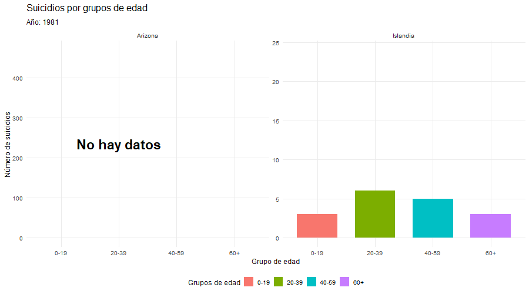

# INTRODUCCIÓN

**Islandia** se caracteriza por su clima frio y extremo, además de por la escasa cantidad de luz durante gran parte del año.
En cambio, **Arizona** tiene un clima cálido y seco, con abundante luz solar la mayor parte del tiempo.
Estos dos lugares, con climas tan extremos y distintos, permiten evaluar de manera comparativa como diferentes condiciones climáticas pueden influir en la **salud mental** y en la tasa de **suicidios**.

# OBJETIVOS

## Objetivo general

Analizar la posible relación entre las condiciones climáticas y la salud mental, evaluando como el clima podría influir en la tasa de suicidios en Islandia y Arizona.

## Objetivos especificos

-   Analizar la evolución de las temperaturas en Islandia y Arizona para identificar tendencias climáticas.
-   Comparar las tasas de suicidio por año y por sexo en ambos lugares.
-   Estudiar la influencia de factores demográficos y socioeconómicos en las variaciones de suicidio.

# METODOLOGÍA

## 1.1. Carga de paquetes:

A continuación se encuentran los paquetes empleados para cargar y trabajar con los datos del seminario.

```{r setup, message=FALSE, warning=FALSE}

library(tidyverse)
library(readr)
library(lubridate)
library(rjstat)     
library(jsonlite)
library(rjson)
library(tidyjson)
library(plotly)
library(dplyr)
library(gganimate)
library(gifski)
```

## 1.2. Obtención de datos de temperatura y suicidio (Islandia y Arizona)

Para la obtencion de datos hemos realizado diversas busquedas en bases de datos y consultas a una API.

### 1.2.1 Importacion de datos de temperatura:

#### Arizona:

Obtenemos los datos de temperatura de Arizona, desde un archivo .csv y desde un archivo .json:

```{r}
# Importacion datos temperatura Arizona .json
Arizona_temp_json <- fromJSON(file = "INPUT/DATA/Arizona/Temperatura/data.json")
# Para visualizar el resultado
#Arizona_temp_json %>%
 # spread_all() %>%
  #View()

# Importacion .csv datos temperatura Arizona
Arizona_temp_csv <- read_delim(file="INPUT/DATA/Arizona/Temperatura/data.csv", delim = ",",
  show_col_types = FALSE)
#View(Arizona_temp_csv)
```

Aunque disponemos de los datos de temperatura en ambos formatos, optaremos por utilizar el archivo .csv, ya que es más sencillo de manejar y el formato .json nos ha generado problemas.

#### Islandia:

El siguiente código Python define las funciones necesarias para consultar la API de Veðurstofa Íslands (api.vedur.is), buscar la estación por nombre ("Reykjav"), solicitar la temperatura media diaria (t) y guardar el resultado en archivos CSV y JSON.
La consulta se ha realizado con ayuda de la IA.

```{python, eval=FALSE}
import os, sys
sys.path.append(os.path.join(os.getcwd(), "API")) #Para buscar la carpeta con la API.

from islandiaTemp import find_station_id_by_name_hint, get_daily_t, get_monthly_t, save

CITY_HINT = "Reykjav"
START = "1980-01-01"
END = "2023-12-31"
OUT_PREFIX = "temperatura_reykjavik_2018_2023" #Guardar el .json para luego usarlo.

station_id = find_station_id_by_name_hint(CITY_HINT)
daily = get_daily_t(station_id, START, END)

if not daily.empty:
    save(daily, OUT_PREFIX)
else:
    monthly = get_monthly_t(station_id, START, END)
    save(monthly, OUT_PREFIX + "_mensual")
```

Importacion de los datos de temperatura de Islandia (Reikiavik) en .json, en el periodo del 1980-2023:

```{r}
# Importacion datos temperatura Islandia .json
Islandia_temp_json <- fromJSON(file = "INPUT/DATA/Islandia/Temperatura/temperatura_reykjavik_1980_2023.json")
# Para visualizar el resultado
#Islandia_temp_json %>%
 # spread_all() #%>%
  #View()
```

### 1.2.2. Importacion de datos de suicidios:

#### Arizona:

Importamos los datos de suicidios de Arizona (relacionados con salud mental) desde un archivo CSV.
Se utilizo la ayuda de la IA para poder importar los archivos correctamente ya que contenia los datos encapsulados con dobles comillas y más caracteres que dificultaban su procesamiento.

Importamos primeramente un csv que contiene información sobre suicidios clasificados por rangos de edad, sexo y regiones de Arizona.
Con `delim = "\n"` indicamos que se lea linea por linea sin separar todavia por comas.
`col_names = FALSE` especifica que el archivo no tiene encabezados y `show_col_types = FALSE` evita que se muestre la información de columnas sin leer.

El resultado es un data frame "datos" de una sola columna donde cada fila es toda una linea del csv.

```{r}
datos <- read_delim(
  "INPUT/DATA/Arizona/Salud/Arizona_condado_edad.csv",
  delim = "\n",  # Leer línea por línea
  col_names = FALSE,
  show_col_types = FALSE
)
#View(datos)
```

A continuación, con `mutate(linea = .[[1]])` creamos una nueva columna llamada linea que contiene una copia de toda la primera columna del data frame original, y se toma la primera columna de datos.
Obteniendo asi un data frame con 2 columnas: la original y "linea" que tiene la misma información.

Utilizamos `separate()` para dividir la columna "linea" en varias columnas nuevas: `into =c(...)` define los nombres de las nuevas columnas + `sep = ',(?=(?:[^"]*"[^"]*")*[^"]*$)'` se usa para separar las columnas por comas que no esten dentro de las dobles comillas. `extra = "merge"` se ussa para que si hay mas columnas de las esperadas, todo eso se junta en una ultima columna extra para evitar que de error a la hora de ejecutarlo. Luego, con `mutate(across(everything(), ~str_replace_all(., '"', '')))` se aplica la misma función a todas las columnas y elimina las dobles comillas.
A continuación, con `select(-1)` se elimina la primera columna original del data frame que contenia la linea completa, y con `slice(-1)` se elimina la primera fila que contenia los encabezados del csv y ya no son necesarios.

Por último, se convierte todas las columnas de años de tipo texto a numérico con `across(`2015`:`2023`, readr::parse_number)`.

El resultado es un data frame "Arizona" que tiene columnas separadas para cada tipo de dato limpias de dobles comillas.

```{r}
# Separar y limpiar
Arizona <- datos %>%
  mutate(linea = .[[1]]) %>%
  separate(linea,
           into = c("County", "Sex", "Age_Group", "2015", "2016", 
                    "2017", "2018", "2019", "2020", "2021", "2022", "2023"),
           sep = ',(?=(?:[^"]*"[^"]*")*[^"]*$)',  # Separar por comas fuera de comillas
           extra = "merge") %>%
  mutate(across(everything(), ~str_replace_all(., '"', ''))) %>%  # Quitar comillas
  select(-1) %>%  # Eliminar la primera columna original
  slice(-1)  # Eliminar la fila de encabezados si quedó duplicada

# Convertir años a numérico
Arizona <- Arizona %>%
  mutate(across(`2015`:`2023`, readr::parse_number))

# Ver resultado
#View(Arizona)
```

Además, se importo otro archivo .csv para complementar los datos de suicidios de Arizona desde el 2018-2023.

Se importa un csv que contiene datos de suicidios y otras causas de muerte, con `header = TRUE` se indica que la primera fila contiene los nombres de las columnas y con `stringsAsFactors = FALSE` se evita que las columnas de texto se conviertan en factores, se mantienen como strings.

El resultado sería un data frame `datos2` que contiene en la primera fila los nombres de las columnas y en las demas los datos respectivos al csv.

```{r}
# Importacion .csv datos suicidios de Arizona (relacionado con salud mental)
datos2 <- read.csv("INPUT/DATA/Arizona/Salud/reports-data-export.csv",
                   header = TRUE,
                   stringsAsFactors = FALSE)

#View(datos2)
```

A continuación, se utiliza `mutate(linea = .[[1]]) %>%` y `mutate(across(everything(), ~str_replace_all(., '"', ''))) %>%` al igual que en csv anterior.

```{r}
# Usar una expresión regular más sofisticada para separar respetando las comillas
datos_separados <- datos2 %>%
  mutate(linea = .[[1]]) %>%
  separate(linea,
           into = c("Intent", "Year", "Age_Group", "Sex", "Deaths", 
                    "Population", "Crude_Rate", "Age_Adjusted_Rate", 
                    "Years_Potential_Life_Lost"),
           sep = ',(?=(?:[^"]*"[^"]*")*[^"]*$)',  # Separar por comas fuera de comillas
           extra = "merge") %>%
  mutate(across(everything(), ~str_replace_all(., '"', ''))) %>%  # Quitar comillas
  select(-1)  # Eliminar la primera columna original

# Ver resultado
#View(datos_separados)
```

#### Islandia:

Importamos los datos de suicidios de Islandia desde un archivo JSON con formato JSON-stat.

```{r}
# Importacion .json datos suicidios de Islandia (relacionado con salud mental)
Islandia_suicidio_json <- fromJSONstat("INPUT/DATA/Islandia/Salud/suicidios_islandia.json")
df <- as.data.frame(Islandia_suicidio_json)
#View(df)
```

### 1.2.3. Importacion de datos del PIB per capita.

Además de los datos de temperatura y suicidios, se han incorporado datos de PIB per cápita debido a su fácil accesibilidad y relevancia socioeconómica.
El objetivo de incluir esta variable es explorar si el nivel de riqueza media por habitante podría estar relacionado, directa o indirectamente, con las variaciones en las tasas de suicidio, y poder visualizarlo con ambos climas tan diferentes.

#### Arizona:

```{r}
pib_arizona <- read.csv("INPUT/DATA/Arizona/pib/pib_arizona.csv",
                        header = TRUE,
                        stringsAsFactors = FALSE)
```

#### Islandia:

```{r}
pib_islandia <- read.csv("INPUT/DATA/Islandia/pib/pib_islandia.csv",
                   header = TRUE,
                   stringsAsFactors = FALSE)
```

## 1.3. Limpieza y preparación de datos

Los archivos originales contienen una gran cantidad de información que no resulta relevante para los objetivos de este seminario.
Por ello, se ha llevado a cabo un proceso de limpieza y filtrado para conservar únicamente aquellas variables relacionadas con las tasas de suicidio y la temperatura.

Asimismo, es importante destacar que no todas las fuentes presentan datos a partir del mismo año.
Aunque el periodo de referencia del estudio comienza en 1980, algunos conjuntos de datos no cubren todo este intervalo.
En particular, los datos de suicidios de Arizona solo están disponibles a partir de 2015, a diferencia de Islandia, cuyos registros se remontan a 1980.
Ante esta limitación, se ha optado por adaptar el análisis a la disponibilidad real de los datos, aplicando estrategias diferenciadas según el caso para garantizar la coherencia y validez de los resultados.

### 1.3.1.Limpieza y preparación de datos de temperatura

#### Arizona:

Filtramos del `Arizona_temp_csv` los datos de temperatura media entre los años 1980 y 2023, y creamos nuevas columnas para el año, mes y convertimos la temperatura de Fº a Cº (`(Value - 32) * 5/9,`), redondeando el valor final para que sean datos más faciles de manejar (`round()`).

```{r}
Arizona_temp_filtrado <- Arizona_temp_csv %>%
  filter(Date >= 198001 & Date <= 202312) %>%
  mutate(
    Year = Date %/% 100,
    Month = Date %% 100,
    Value = round((Value - 32) * 5/9, 1)
  ) %>%
  select(Year, Month, Value)

#View(Arizona_temp_filtrado)
```

#### Islandia:

En el caso de Islandia , los datos ya están filtrados en el archivo JSON, por lo que no es necesario realizar un filtrado adicional.

### 1.3.2.Limpieza y preparación de datos de suicidios

#### Arizona:

Del primer csv eliminamos los NA y los convertimos a 0.

```{r}
#Convertir los NA a 0
Arizona_2015_2023 <- Arizona %>%
  mutate(across(`2015`:`2023`, ~replace_na(., 0)))
#View(Arizona_2015_2023)
```

Filtramos los datos de suicidios de Arizona pero solo del segundo csv ya que el primero es por regiones y ya vienen especificados los años.
Primeramente hay que convertir los datos a tipo numerico para poder trabajar con ellos, para esto utilizamos `parse_number()` que extrae los números automatícamente, ignora comas, asteriscos, estapcios, etc. y covierte automáticamente a NA si no hay número.

```{r, message=FALSE, warning=FALSE}
# Limpieza de datos - convertir a numérico
arizona_csv <- datos_separados %>%
  mutate(
    Year = parse_number(Year),
    Deaths = parse_number(Deaths),
    Population = parse_number(Population),
    Crude_Rate = parse_number(Crude_Rate),
    Age_Adjusted_Rate = parse_number(Age_Adjusted_Rate),
    Years_Potential_Life_Lost = parse_number(Years_Potential_Life_Lost)
  )

# Ver resumen
#View(arizona_csv)
```

Posteriormente, filtramos solo los suicidios entre los años 2018 y 2023.

```{r}
# Filtrar solo suicidios
arizona_suicidios <- arizona_csv %>%
  filter(Intent == "Suicide")

# Ver el resultado
#View(arizona_suicidios)
```

#### Islandia:

Se han filtrado los datos de suicidio de Islandia para el periodo 1981–2023.

```{r}
suicidios_Islandia <- df %>%
  mutate(Year = as.numeric(Year)) %>%
  filter(Year >= 1981 & Year <= 2023)

# Contar observaciones por año
#suicidios_Islandia %>%
 # count(Year)
#View(suicidios_Islandia)
```

### 1.3.3.Limpieza y preparación de datos de PIB.

#### Arizona:

Se calcula la temperatura media anual de Arizona desde el año 2000, agrupando por año y promediando la temperatura.
Después, se hace un left_join con el PIB per cápita usando el año como clave, de manera que Arizona_temp_pib_anual contiene, para cada año, la temperatura media anual y el PIB per cápita ordenados cronológicamente.

```{r}
Arizona_temp_anual <- Arizona_temp_filtrado %>%
  filter(Year >= 2000) %>%                 
  group_by(Year) %>%
  summarise(
    temp_media_anual = mean(Value, na.rm = TRUE),
  )
#view(Arizona_temp_anual)

Arizona_temp_pib_anual <- Arizona_temp_anual %>%
  left_join(pib_arizona, by = c("Year" = "year")) %>%
  arrange(Year)

#View(Arizona_temp_pib_anual)
```

#### Islandia:

Hacemos un left_join con el PIB per cápita usando el año como clave, de forma que en islandia_temp_pib_anual tenemos, para cada año, la temperatura media anual y el PIB per cápita ordenados cronológicamente.

```{r}
df_temp <- Islandia_temp_json %>% 
  spread_all() %>% 
  select(fecha, temperatura_media) %>% 
  mutate(
    fecha = as.Date(fecha),
    temperatura_media = as.numeric(temperatura_media),
    año = year(fecha)
  )
#Creamos data frame con la temperatura media anual en Islandia
islandia_temp_anual <- df_temp %>%
  group_by(año) %>%
  summarise(
    temp_media_anual = mean(temperatura_media, na.rm = TRUE),
    .groups = "drop"
  ) %>%
  rename(Year = año)

#La temp media a partir de df_temp que ya tenemos creada.
islandia_1981 <- islandia_temp_anual %>%
  filter(Year>=1981)

islandia_temp_pib_anual <- islandia_1981 %>%
  left_join(pib_islandia, by = c("Year" = "year")) %>%
  arrange(Year)
```

# GRÁFICAS Y RESULTADOS

A continuación se muestran las gráficas obtenidas a partir de los datos importados y filtrados.

## 2.1. Gráficas individuales

Gráficas individuales.

En primer lugar, se obtuvieron gráficas individuales para cada lugar con respecto a la variación de temperatura y suicidios.

### 2.1.1. Gráficas de temperatura

Se generaron gráficas que muestran la evolución de la temperatura en ambos lugares.
El procedimiento ha sigo igual en ambos, se crea un data frame que contenga unicamente la información de la fecha y la temperatura.
Posteriormente se filtra para obtener un data frame que agrupe la información por años y calcule la media de cada uno de ellos.
Finalmente se crea el gráfico utilizando este último data frame.

#### Arizona:

```{r}
# Gráfica de temperatura en Arizona 
df_temp_arizona <- Arizona_temp_filtrado %>%
  mutate(
    fecha = as.Date(paste(Year, Month, "01", sep = "-"))
  )

# Resumen anual  
df_resumen_arizona <- df_temp_arizona %>%
  group_by(Year) %>%
  summarise(
    temp_media = mean(Value, na.rm = TRUE),
    .groups = "drop"
  )

# Gráfico de temperatura  
graf_temp_arizona <- ggplot(df_resumen_arizona, aes(x = Year, y = temp_media)) +
  geom_line(linewidth = 1.2, color = "#f39c12") +
  geom_point(size = 3, color = "#f39c12") +
  labs(
    title = "Evolución de la Temperatura Media en Arizona",
    subtitle = "Arizona 1980-2023",
    x = "Año",
    y = "Temperatura Media (°C)"
  ) +
  theme_minimal(base_size = 12) +
  theme(
    plot.title = element_text(face = "bold", size = 16),
    panel.grid.minor = element_blank()
  )

print(graf_temp_arizona)
```

#### Islandia:

```{r}
# Resumen anual ---------------------------------------------------------
df_resumen <- df_temp %>% 
  group_by(año) %>% 
  summarise(
    temp_media = mean(temperatura_media, na.rm = TRUE),
    .groups = "drop"
  )

graf_temp_islandia <- ggplot(df_resumen, aes(x = año, y = temp_media)) +
  geom_line(linewidth = 1.2, color = "#3498db") +
  geom_point(size = 3, color = "#3498db") +
  labs(
    title = "Evolución de la Temperatura Media en Reykjavik",
    subtitle = "Reykjavik 1980-2023",
    x = "Año",
    y = "Temperatura Media (°C)"
  ) +
  theme_minimal(base_size = 12) +
  theme(
    plot.title = element_text(face = "bold", size = 16),
    panel.grid.minor = element_blank()
  )

print(graf_temp_islandia)
```

### 2.1.2.Gráficas de suicidios

Se generaron gráficas que muestran la tasa de suicidios por año enfrentando hombres (azul) y mujeres (rojo).

#### Arizona:

##### Por sexo:

```{r}
Arizona_l <- Arizona_2015_2023 %>%
  pivot_longer(
    cols = `2015`:`2023`,
    names_to = "Year",
    values_to = "Deaths"
  ) %>%
  mutate(
    Year = as.numeric(Year),
    Deaths = as.numeric(Deaths)
  )


arizona_suic_sexo_2015 <- Arizona_l %>%
  filter(!is.na(Deaths)) %>% 
  group_by(Year, Sex) %>%
  summarise(Total_Deaths = sum(Deaths, na.rm = TRUE), .groups = "drop")

graf_suicHF_ariz <- ggplot(arizona_suic_sexo_2015,
                                aes(x = Year, y = Total_Deaths, color = Sex, group = Sex)) +
  geom_line(linewidth = 1.2) +
  geom_point(size = 2) +
  scale_color_manual(
    values = c("Male" = "#3498db", "Female" = "#e74c3c"),
    labels = c("Female" = "Mujeres", "Male" = "Hombres")
  ) +
  labs(
    title = "Suicidios por Sexo en Arizona",
    subtitle = "2015–2023",
    x = "Año",
    y = "Número de suicidios",
    color = "Sexo"
  ) +
  theme_minimal(base_size = 12) +
  theme(
    plot.title = element_text(face = "bold", size = 16),
    panel.grid.minor = element_blank(),
    legend.position = "top"
  )

print(graf_suicHF_ariz)
```

##### Por región:

Utilizando el primer csv que contiene datos de los suicios por año y separados con región, creamos un grafico en que visualicemos la cantidad de suicidios en cada region desde 2015 hasta 2023.

Se puede observar que durante esos 9 años, la región de Maricopa fue la que tuvo un mayor indice de suicidios.

```{r}
region_suicidios_2015 <- Arizona_l %>%
  group_by(Year, County) %>%
  summarise(Promedio_Deaths = mean(Deaths, na.rm = TRUE), .groups = "drop") %>%
  group_by(Year) %>%
  slice_max(Promedio_Deaths, n = 15) %>%
  ungroup()

graf_region_arizona <- ggplot(region_suicidios_2015, aes(x = reorder(County, Promedio_Deaths), y = Promedio_Deaths)) +
  geom_col(fill = "#e74c3c") +
  facet_wrap(~Year, scales = "free_y") +
  coord_flip() +
  labs(
    title = "Condados de Arizona por Suicidios",
    x = "Condado",
    y = "Número promedio de suicidios"
  ) +
  theme_minimal()

print(graf_region_arizona)
```

#### Islandia:

```{r}
df_clean <- suicidios_Islandia

df_sexo <- suicidios_Islandia %>%
  filter(Age == "Total", Sex != "Total")

graf_suicHF_isl <- ggplot(df_sexo, aes(x = Year, y = value, color = Sex, group = Sex)) +
  geom_line(linewidth = 1.2) +
  geom_point(size = 2) +
  scale_color_manual(values = c("Males" = "#3498db", "Females" = "#e74c3c"),
                     labels = c("Females" = "Mujeres", "Males" = "Hombres")) +
  labs(title = "Suicidios por Sexo en Islandia",
       subtitle = "1980–2023",
       x = "Año",
       y = "Número de suicidios",
       color = "Sexo") +
  theme_minimal(base_size = 12) +
  theme(plot.title = element_text(face = "bold", size = 16),
        panel.grid.minor = element_blank(),
        legend.position = "top")

print(graf_suicHF_isl)
```

## 2.2. Gráficas combinadas/comparativas

### 2.2.1. Comparación de PIB, suicidios y temperatura

Se diseña un gráfico con un eje Y doble (PIB y Temperatura) para visualizar la evolución de ambas variables a lo largo de los años.

#### Arizona:

Con este gráfico vamos a ver, para Arizona, cómo evoluciona el PIB per cápita (barras azules, en miles de euros) y la temperatura media anual (línea roja) a lo largo de los años.
Nos permite comparar visualmente si los cambios económicos y los cambios en la temperatura siguen patrones similares o no en el mismo periodo de tiempo.

```{r}
#Grafico de visualizacion con PIB Arizona:
ggplot(Arizona_temp_pib_anual, aes(x = Year)) +
  geom_col(aes(y = pib_per_capita / 1000, fill = "PIB per cápita"), alpha = 0.6) +
  geom_line(aes(y = temp_media_anual / 2, color = "Temperatura media anual"), linewidth = 1.1) +
  geom_point(aes(y = temp_media_anual / 2, color = "Temperatura media anual")) +
  scale_y_continuous(
    name = "PIB per cápita (miles de €)",
    sec.axis = sec_axis(~ . * 2, name = "Temperatura media anual (°C)")
  ) +
  scale_fill_manual(name = "", values = c("PIB per cápita" = "steelblue")) +
  scale_color_manual(name = "", values = c("Temperatura media anual" = "red")) +
  labs(
    title = "Arizona: PIB per cápita y temperatura media anual",
    subtitle = "2000–2023",
    x = "Año"
  ) +
  theme_minimal() +
  theme(legend.position = "bottom")
```

#### Islandia:

En este gráfico vamos a observar la evolución del PIB per cápita en Islandia (barras, en miles de euros) junto con la temperatura media anual (línea roja) a lo largo del tiempo.

```{r}
#Grafico de visualizacion con PIB Islandia:
ggplot(islandia_temp_pib_anual, aes(x = Year)) +
  geom_col(aes(y = pib_per_capita / 1000, fill = "PIB per cápita"), alpha = 0.6) +
  geom_line(aes(y = temp_media_anual / 2, color = "Temperatura media anual"), linewidth = 1.1) +
  geom_point(aes(y = temp_media_anual / 2, color = "Temperatura media anual")) +
  scale_y_continuous(
    name = "PIB per cápita (miles de €)",
    sec.axis = sec_axis(~ . * 2, name = "Temperatura media anual (°C)")
  ) +
  scale_fill_manual(name = "", values = c("PIB per cápita" = "steelblue")) +
  scale_color_manual(name = "", values = c("Temperatura media anual" = "red")) +
  labs(
    title = "Islandia: PIB per cápita y temperatura media anual",
    subtitle = "1980–2023",
    x = "Año"
  ) +
  theme_minimal() +
  theme(legend.position = "bottom")
```

### 2.2.2. Comparación de Suicidios

Transformamos los datos de suicidios de Arizona e Islandia para agruparlos en cuatro categorías de edad simplificadas: "0-19", "20-39", "40-59" y "60+".
Después, combinamos ambos data frames para generar visualizaciones comparativas.

```{r}
arizona_edad_simpl <- Arizona_2015_2023 %>%
  # Convertimos de formato ancho a largo
  pivot_longer(
    cols = `2015`:`2023`,
    names_to = "Year",
    values_to = "Deaths"
  ) %>%
  mutate(Year = as.numeric(Year)) %>%
  filter(
    !is.na(Deaths),
    Age_Group != "Total",
    Year >= 2015, Year <= 2023
  ) %>%
  # Sacamos el primer número de la categoría de edad
  mutate(
    edad_inicio = as.numeric(str_extract(Age_Group, "\\d+")),
    # Clasificamos la edad de inicio en 4 grupos
    Grupo_edad = case_when(
      edad_inicio < 20 ~ "0-19",
      edad_inicio < 40 ~ "20-39",
      edad_inicio < 60 ~ "40-59",
      TRUE            ~ "60+"
    )
  ) %>%
  # Eliminamos filas que no tengan una edad de inicio válida
  filter(!is.na(edad_inicio)) %>%
  group_by(Year, Grupo_edad) %>%
  # Calculamos el total de muertes por grupo de edad y año
  summarise(
    Total_Deaths = sum(Deaths, na.rm = TRUE),
    .groups = "drop"
  ) %>%
  mutate(Pais = "Arizona")

# Hacemos lo mismo para Islandia.
islandia_edad_simpl <- suicidios_Islandia %>% # Nota: Usamos 'suicidios_Islandia' del paso 1.3.2.
  filter(
    Age != "Total",
    Sex == "Total",
    Year >= 1980, Year <= 2023,
    !is.na(value)
  ) %>%
  #creamos la columna de edad de inicio y grupo de edad.
  mutate(
    edad_inicio = as.numeric(str_extract(Age, "\\d+")),
    Grupo_edad = case_when(
      edad_inicio < 20 ~ "0-19",
      edad_inicio < 40 ~ "20-39",
      edad_inicio < 60 ~ "40-59",
      TRUE            ~ "60+"
    )
  ) %>%
  # eliminamos filas sin edad de inicio valida.
  filter(!is.na(edad_inicio)) %>%
  group_by(Year, Grupo_edad) %>%
  #calculamos el total de muertes por grupo de edad y año.
  summarise(
    Total_Deaths = sum(value, na.rm = TRUE),
    .groups = "drop" # el drop es para evitar mensajes de agrupamiento.
  ) %>%
  mutate(Pais = "Islandia")

# Unimos ambos data frames para la comparación
comparacion_edad_simpl <- bind_rows(arizona_edad_simpl, islandia_edad_simpl) %>%
  mutate(
    Grupo_edad = factor(Grupo_edad,
                        levels = c("0-19", "20-39", "40-59", "60+"))
  )
```

#### Animación:

Generamos una animación para visualizar la evolución anual de los suicidios por grupo de edad, facilitando la comprensión de las tendencias.
Sin embargo, debido a la limitada disponibilidad y transparencia de los datos en Estados Unidos, los registros de Arizona solo están disponibles a partir de 2015, mientras que Islandia cuenta con datos desde 1980.
Por esta razón, en la animación aparece el aviso de “No hay datos” para Arizona en los años anteriores a 2015, mientras que Islandia muestra información continua durante todo el periodo.

```{r, eval=FALSE}
# Realizamos la animación con gganimate.
# Años del dataset
years_all <- sort(unique(comparacion_edad_simpl$Year))
# Años con datos de Arizona
years_arizona <- sort(unique(
  comparacion_edad_simpl$Year[comparacion_edad_simpl$Pais == "Arizona"]
))
# Años sin datos de Arizona (pero con Islandia)
years_no_data_arizona <- setdiff(years_all, years_arizona)

niveles_edad <- levels(factor(comparacion_edad_simpl$Grupo_edad))
x_centro <- niveles_edad[ceiling(length(niveles_edad) / 2)]

max_arizona <- comparacion_edad_simpl %>%
  filter(Pais == "Arizona") %>%
  summarise(maxT = max(Total_Deaths, na.rm = TRUE)) %>%
  pull(maxT)

no_data_df <- data.frame(
  Pais  = "Arizona",
  Year  = years_no_data_arizona,
  x_lab = x_centro,
  y_pos = max_arizona / 2,
  label = "No hay datos"
)

p_anim_edad <- ggplot(
  comparacion_edad_simpl,
  aes(x = Grupo_edad,
      y = Total_Deaths,
      fill = Grupo_edad)
) +
  #Para podeer colocarlo para que se vea bien.
  geom_col(width = 0.7) +
  geom_text(
    data = no_data_df,
    aes(x = x_lab, y = y_pos, label = label),
    inherit.aes = FALSE,
    size = 8,         
    fontface = "bold",
    hjust = 0.5,
    vjust = 0.5
  ) +
  facet_wrap(~ Pais, scales = "free_y") +
  labs(
    title = "Suicidios por grupos de edad",
    subtitle = "Año: {closest_state}",
    x = "Grupo de edad",
    y = "Número de suicidios",
    fill = "Grupos de edad"
  ) +
  theme_minimal(base_size = 12) +
  theme(
    plot.title = element_text(face = "bold", size = 16),
    panel.grid.minor = element_blank(),
    legend.position = "bottom"
  ) +
  transition_states(
    Year,
    transition_length = 2,
    state_length = 1
  ) +
  ease_aes("linear")
#Para cambiar la velocidad y otros ajustes.
anim_edad <- animate(
  p_anim_edad,
  nframes = 200,   
  fps =5 ,         
  width = 900,
  height = 500,
  renderer = gifski_renderer()
)

anim_edad
#anim_save("IMAGES/suicidios_grupos_edad_Arizona_Islandia.gif", animation = anim_edad)
```

```{r, echo=FALSE, out.width='600px'}

```

A partir de los datos simplificados, generamos un gráfico de líneas para comparar la evolución anual de los suicidios por grupo de edad en Arizona e Islandia.

#### 1980 - 2023:

Primero hacemos una comparación desde el año 1980, aunque en Arizona solo tengamos datos desde el 2015.

```{r}
# Hacemos el gráfico comparativo de suicidios por grupo de edad en ambos paises desde 1980.
graf_comp_edad_simpl_1980_2023 <- ggplot(
  comparacion_edad_simpl,
  aes(x = Year, y = Total_Deaths,
      color = Grupo_edad, group = Grupo_edad)
) +
  geom_line(linewidth = 1.2) +
  geom_point(size = 2) +
  facet_wrap(~ Pais, scales = "free_y") +   # escala libre por país
  labs(
    title = "Suicidios por Grandes Grupos de Edad",
    subtitle = "Comparación Arizona vs Islandia (1980–2023)",
    x = "Año",
    y = "Número de suicidios",
    color = "Grupo de edad"
  ) +
  theme_minimal(base_size = 12) +
  theme(
    plot.title = element_text(face = "bold", size = 16),
    panel.grid.minor = element_blank(),
    legend.position = "bottom"
  )

print(graf_comp_edad_simpl_1980_2023) #grafico de suicidios por grupo de edad en los dos sitios
```

#### 2015 - 2023:

Ajustamos el rango de años desde el 2015 hasta el 2023 para tener una mejor comparación de los suicidios por grupos de edad entre esos años en ambos lugares.

```{r}
# Filtramos solo los años 2015–2023
comparacion_edad_simpl_2015_2023 <- comparacion_edad_simpl %>%
  filter(Year >= 2015, Year <= 2023)

# Gráfico comparativo solo 2015–2023  ---------------------------------------------------------
graf_comp_edad_simpl_2015_2023 <- ggplot(
  comparacion_edad_simpl_2015_2023,
  aes(x = Year, y = Total_Deaths,
      color = Grupo_edad, group = Grupo_edad)
) +
  geom_line(size = 1.2) +
  geom_point(size = 2) +
  facet_wrap(~ Pais, scales = "free_y") +
  labs(
    title = "Suicidios por Grandes Grupos de Edad",
    subtitle = "Comparación Arizona vs Islandia (2015–2023)",
    x = "Año",
    y = "Número de suicidios",
    color = "Grupo de edad"
  ) +
  theme_minimal(base_size = 12) +
  theme(
    plot.title = element_text(face = "bold", size = 16),
    panel.grid.minor = element_blank(),
    legend.position = "bottom"
  )

print(graf_comp_edad_simpl_2015_2023)
```

#### Por cada 100.000 habitantes:

Por ultimo, se crea un gráfico que muestra la tasa de suicidios por cada 100.000 habitantes en los dos lugares desde el 2015 hasta el 2023.
Para facilitar la comparación se han ajustado los datos por poblacion de manera que las medidas sean equitativas para ambos.

Cada uno de los puntos del gráfico muestra la tasa de suicidios por cada 100.000 habitantes redondeada para una mayor claridad.

```{r}
# Arizona
arizona_tasas <- Arizona_2015_2023 %>%
  # Convertir de formato ancho a largo
  pivot_longer(
    cols = `2015`:`2023`,
    names_to = "Year",
    values_to = "Deaths"
  ) %>%
  mutate(Year = as.numeric(Year)) %>%
  # Sumar todas las muertes por año (todos los condados, sexos y edades)
  group_by(Year) %>%
  summarise(
    Total_Deaths = sum(Deaths, na.rm = TRUE)
  ) %>%
  mutate(
    Region = "Arizona",
    Poblacion = 7400000,  # Población aproximada
    Tasa_100k = (Total_Deaths / Poblacion) * 100000
  )

# Islandia
suicidios_Islandia_2015 <- df %>%
  mutate(Year = as.numeric(Year)) %>%
  filter(Year >= 2015 & Year <= 2023)

islandia_tasas <- suicidios_Islandia_2015 %>%
  filter(Age == "Total") %>%  # Solo totales para evitar duplicar
  group_by(Year) %>%
  summarise(
    Total_Deaths = sum(value, na.rm = TRUE)
  ) %>%
  mutate(
    Region = "Islandia",
    Poblacion = 380000,  # Población aproximada
    Tasa_100k = (Total_Deaths / Poblacion) * 100000
  )

comparacion_tasas <- arizona_tasas %>%
  select(Year, Tasa_100k_Arizona = Tasa_100k) %>%
  inner_join(
    islandia_tasas %>% select(Year, Tasa_100k_Islandia = Tasa_100k),
    by = "Year"
  )

# colnames(comparacion_tasas)

comparacion_tasas_100k <- comparacion_tasas %>%
  pivot_longer(
    names_to = "Region",
    values_to = "Valor",
    cols = c ("Tasa_100k_Arizona", "Tasa_100k_Islandia")
  ) %>%
  mutate(
    Region = case_when(
      Region == "Tasa_100k_Arizona" ~ "Arizona",
      Region == "Tasa_100k_Islandia" ~ "Islandia",
      TRUE ~ Region
    )
  )

graf_tasas_comparadas <- ggplot(comparacion_tasas_100k, aes(x = Year, y = Valor, color = Region, group = Region)) +
  geom_line(linewidth = 1.2) +
  geom_point(size = 3) +
  geom_text(aes(label = round(Valor, 1)), vjust = -1, size = 3) +
  scale_x_continuous(breaks = 2015:2023) +
  labs(
    title = "Tasa de Suicidios por 100,000 Habitantes",
    subtitle = "Comparación ajustada por población (2015-2023)",
    x = "Año",
    y = "Tasa por 100,000 hab.",
    color = "Región"
  ) +
  theme_minimal() +
  theme(
    plot.title = element_text(face = "bold", size = 14),
    legend.position = "bottom",
    panel.grid.minor = element_blank()
  )

print(graf_tasas_comparadas)
```

### 2.2.3. Analisis de correlacion entre temperatura y suicidios

Por último, se explora de forma descriptiva si existe una posible relación lineal entre la temperatura media anual y el número total de suicidios en el periodo 2015–2023.
Para ello se calcula, en cada país, la temperatura media anual y el total de suicidios por año, y se representa un diagrama de dispersión con recta de regresión, junto con el coeficiente de correlación de Pearson.

#### Arizona:

##### Total:

```{r}
arizona_suic_anual_2015 <- Arizona_2015_2023 %>%
  pivot_longer(
    cols = `2015`:`2023`,
    names_to = "Year",
    values_to = "Deaths"
  ) %>%
  mutate(
    Year = as.numeric(Year),
    Deaths = as.numeric(Deaths)
  ) %>%
  group_by(Year) %>%          
  summarise(
    suicidios_totales = sum(Deaths, na.rm = TRUE),
    .groups = "drop"
  )
# --- Datos anuales ya existentes ---
suicidios <- arizona_suic_anual_2015 %>% 
  filter(Year >= 2015, Year <= 2023)

temperaturas <- Arizona_temp_anual %>%
  filter(Year >= 2015, Year <= 2023)

# --- Unión ---
arizona_temp_suic_2015 <- inner_join(
  temperaturas,
  suicidios,
  by = "Year"
)

# colnames(arizona_temp_suic_2015)

# --- Scatter ---
graf_arizona_temp_suic_2015 <- ggplot(arizona_temp_suic_2015,
       aes(x = temp_media_anual, y = suicidios_totales)) +
  geom_point(size = 4, color = "steelblue") +
  geom_smooth(method = "lm", se = FALSE, color = "black", linewidth = 1.2) +
  labs(
    title = "Arizona: Suicidios anuales vs Temperatura media anual",
    subtitle = "(2015–2023)",
    x = "Temperatura media anual (°C)",
    y = "Número total de suicidios"
  ) +
  theme_minimal(base_size = 12)

suppressMessages(print(graf_arizona_temp_suic_2015))

# Correlación simple que es el coeficiente de correlación de Pearson.
cor_arizona <- cor(arizona_temp_suic_2015$temp_media_anual,
                   arizona_temp_suic_2015$suicidios_totales,
                   use = "complete.obs") # complete.obs lo ponemos para evitar NAs
cor_arizona # ver el valor
```

En Arizona, el coeficiente de correlación de Pearson entre temperatura media anual y número de suicidios es muy cercano a cero, lo que indica que, con los datos disponibles, **no se observa una relación lineal clara** entre ambas variables.

##### Por grupos de edad:

```{r}
# Unimos la temperatura anual con los suicidios por grupo de edad en Arizona
arizona_edad_temp_csv <- arizona_edad_simpl %>%
  inner_join(Arizona_temp_anual, by = "Year")

#Creamos gráfico
graf_arizona_temp_edad_csv <- ggplot(
  arizona_edad_temp_csv,
  aes(x = temp_media_anual,
      y = Total_Deaths,
      color = Grupo_edad)
) +
  geom_point(size = 3) +
  geom_smooth(method = "lm", se = FALSE) +
  labs(
    title = "Arizona: Suicidios vs Temperatura media anual",
    subtitle = "Por grandes grupos de edad (2015–2023)",
    x = "Temperatura media anual (°C)",
    y = "Número de suicidios",
    color = "Grupo de edad"
  ) +
  theme_minimal(base_size = 12)

suppressMessages(print(graf_arizona_temp_edad_csv))
```

#### Islandia:

##### Total:

```{r}
islandia_suic_anual <- suicidios_Islandia %>%
  filter(Year >= 1980, Year <= 2023,
         Sex == "Total",        
         !is.na(value)) %>%
  group_by(Year) %>%
  summarise(
    suicidios_totales = sum(value, na.rm = TRUE),
    .groups = "drop"
  )
# --- Datos anuales ya existentes ---
suicidios_Isl <- islandia_suic_anual %>% 
  filter(Year >= 1980, Year <= 2023)

temperaturas_Isl <- islandia_temp_anual %>%
  filter(Year >= 1980, Year <= 2023)

# --- Unión ---
islandia_temp_suic <- inner_join(
  temperaturas_Isl,
  suicidios_Isl,
  by = "Year"
)

# --- Scatter ---
graf_islandia_temp_suic <- ggplot(
  islandia_temp_suic,
  aes(x = temp_media_anual, y = suicidios_totales)
) +
  geom_point(size = 3, color = "steelblue") +
  geom_smooth(method = "lm", se = FALSE, color = "black", linewidth = 1.2) +
  labs(
    title = "Islandia: Suicidios vs Temperatura media anual",
    subtitle = "1980–2023",
    x = "Temperatura media anual (°C)",
    y = "Número de suicidios"
  ) +
  theme_minimal(base_size = 12)

suppressMessages(print(graf_islandia_temp_suic))

# Coeficiente de correlación de Pearson

cor_islandia <- cor(
islandia_temp_suic$temp_media_anual,
islandia_temp_suic$suicidios_totales,
use = "complete.obs"
)
cor_islandia
```

En Islandia, el coeficiente de correlación de Pearson entre temperatura media anual y número de suicidios es muy cercano a cero (al igual que en el caso de Arizona), lo que indica que, con los datos disponibles, **no se observa una relación lineal fuerte** entre ambas variables.
La ligera correlación negativa sugiere que podría haber una tendencia mínima de disminución de suicidios cuando la temperatura aumenta, pero el valor es demasiado bajo para considerarlo significativa.

##### Por grupos de edad:

```{r}
# Unimos suicidios por grupo de edad con la temperatura anual en Islandia
islandia_edad_temp <- islandia_edad_simpl %>%
  inner_join(islandia_temp_anual, by = "Year")
# Scatter plot: suicidios contra temperatura, con una línea por grupo de edad
graf_islandia_temp_edad <- ggplot(
  islandia_edad_temp,
  aes(x = temp_media_anual,
      y = Total_Deaths,
      color = Grupo_edad)
) +
  geom_point(size = 2) +
  geom_smooth(method = "lm", se = FALSE) +  
  labs(
    title = "Islandia: Suicidios vs Temperatura media anual",
    subtitle = "Por grandes grupos de edad (1980–2023)",
    x = "Temperatura media anual (°C)",
    y = "Número de suicidios",
    color = "Grupo de edad"
  ) +
  theme_minimal(base_size = 12)

suppressMessages(print(graf_islandia_temp_edad))
```

# CONCLUSIÓN

Tras el análisis conjunto de las tasas de suicidio y la evolución de la temperatura en Arizona e Islandia mediante distintos métodos gráficos y analíticos, **no se ha podido establecer una relación directa y concluyente entre ambas variables.** Los resultados obtenidos indican que el suicidio es un fenómeno complejo y multifactorial, en el que influyen numerosos factores adicionales como el consumo de alcohol y drogas, las horas de luz solar, el contexto socioeconómico, el acceso a la salud mental y las dinámicas sociales.

Por tanto, aunque el **clima extremo puede actuar como un factor modulador**, los datos analizados no permiten afirmar que exista una relación causal directa entre temperatura y suicidio sin considerar el conjunto de variables que intervienen en este fenómeno.

# REFERENCIAS

A continuación se muestran las fuentes de información que se han consultado para obtener los datos e información necesaria para el desarrollo del seminario:

-   **Arizona**

    -   Suicidios:

        -   WISQARS Fatal and Nonfatal Injury Reports.
            (s. f.).
            Centers For Disease Control And Prevention.
            <https://wisqars.cdc.gov/reports/?o=MORT&y1=2023&y2=2023&t=0&i=0&m=20810&g=00&me=0&s=0&r=0&ry=2&e=0&yp=65&a=ALL&g1=0&g2=199&a1=0&a2=199&r1=INTENT&r2=NONE&r3=NONE&r4=NONE>

        -   Lock.
            (s. f.).
            <https://hdpulse.nimhd.nih.gov/data-portal/mortality/table?age=001&age_options=age_11&cod=247&cod_options=cod_15&comparison=states_to_us&comparison_options=comparison_statename_to_us&race=00&race_options=race_6&ratetype=aa&ratetype_options=ratetype_2&ruralurban=0&ruralurban_options=ruralurban_3&sex=1&sex_options=sex_3&statefips=04&statefips_options=area_states&yeargroup=5&yeargroup_options=yearmort_2>

    -   Temperatura:

        -   [NCEI.Monitoring.Info\@noaa.gov](mailto:NCEI.Monitoring.Info@noaa.gov){.email}. (s. f.). Climate at a Glance \| Statewide Time Series \| National Centers for Environmental Information (NCEI). <https://www.ncei.noaa.gov/access/monitoring/climate-at-a-glance/statewide/time-series/2/tavg/1/0/1895-2025>\`

    -   PIB:

        -   PIB per Capita de Arizona. (s. f.). DatosMacro.com. <https://datosmacro.expansion.com/pib/usa-estados/arizona>

-   **Islandia**

    -   Temperatura:

        -   Weather API. (s. f.). Icelandic Meteorological Office (IMO). <https://api.vedur.is/weather/>

    -   Suicidios:

        -   Deaths by cause of death. (s. f.). Statistics Iceland (Hagstofa Íslands). <https://px.hagstofa.is/pxen/pxweb/en/Ibuar/Ibuar__Faeddirdanir__danir__danarmein/MAN05302.px/>

    -   PIB:

        -   PIB a precios de mercado de Islandia. (s. f.). DatosMacro.com. <https://datosmacro.expansion.com/pib/islandia>
